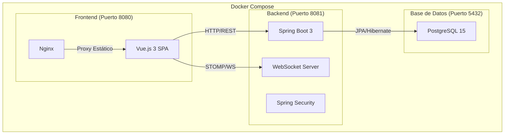
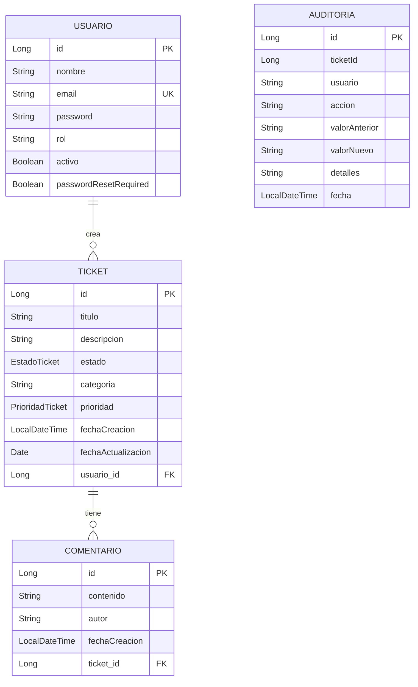

# 🎫 Sistema de Tickets — Documentación Completa

> Plataforma integral de gestión de incidencias con arquitectura de microservicios, comunicación en tiempo real y estética cyberpunk "Matrix".

---

## 📑 Índice

1. [Descripción General](#-descripción-general)
2. [Stack Tecnológico](#-stack-tecnológico)
3. [Arquitectura del Sistema](#-arquitectura-del-sistema)
4. [Modelo de Datos](#-modelo-de-datos)
5. [Backend — API REST](#-backend--api-rest)
6. [Frontend — Interfaz de Usuario](#-frontend--interfaz-de-usuario)
7. [Seguridad y Autenticación](#-seguridad-y-autenticación)
8. [WebSockets — Tiempo Real](#-websockets--tiempo-real)
9. [Funcionalidades Clave](#-funcionalidades-clave)
10. [Despliegue con Docker](#-despliegue-con-docker)
11. [Variables de Entorno](#-variables-de-entorno)
12. [Estructura del Proyecto](#-estructura-del-proyecto)

---

## 🧬 Descripción General

El **Sistema de Tickets** es una aplicación web diseñada para la gestión organizada de incidencias técnicas dentro de una organización. Permite a los usuarios crear, dar seguimiento y resolver tickets de soporte, mientras que los administradores tienen un panel de control completo con métricas, auditoría, generación de reportes PDF y exportación de la base de datos.

### Roles del Sistema

| Rol | Descripción |
|-----|-------------|
| **ROLE_USER** | Puede crear tickets, agregar comentarios y ver el estado de sus incidencias. |
| **ROLE_ADMIN** | Acceso total: gestión de usuarios, tickets, métricas, reportes, auditoría y exportación de BD. |

---

## 🛠️ Stack Tecnológico

| Capa | Tecnología | Versión |
|------|-----------|---------|
| **Base de Datos** | PostgreSQL | 15 (Alpine) |
| **Backend** | Java + Spring Boot | Java 17 / Spring Boot 3 |
| **ORM** | JPA / Hibernate | — |
| **Seguridad** | Spring Security (Basic Auth, BCrypt) | — |
| **WebSockets** | Spring WebSocket + STOMP | — |
| **Frontend** | Vue.js | 3.x (Options API) |
| **HTTP Client** | Axios | — |
| **Gráficas** | Chart.js + vue-chartjs | — |
| **Reportes PDF** | jsPDF + jspdf-autotable | — |
| **Notificaciones** | SweetAlert2 | — |
| **Servidor Web** | Nginx | Alpine |
| **Contenerización** | Docker + Docker Compose | — |

---

## 🏗️ Arquitectura del Sistema



**Flujo de Comunicación:**
1. El navegador carga la SPA desde Nginx (puerto `8080`).
2. La SPA se comunica con el backend vía REST API (puerto `8081`).
3. Las notificaciones en tiempo real fluyen a través de WebSockets (`/ws`).
4. El backend persiste datos en PostgreSQL vía JPA/Hibernate.

---

## 📊 Modelo de Datos



### Enumeraciones

| Enum | Valores |
|------|---------|
| `EstadoTicket` | `ABIERTO`, `EN_PROGRESO`, `RESUELTO` |
| `PrioridadTicket` | `BAJA`, `MEDIA`, `ALTA`, `CRITICA` |
| `Rol` | `ROLE_USER`, `ROLE_ADMIN` |

---

## ⚙️ Backend — API REST

### Controladores y Endpoints

#### 🔐 AuthController — `/api/auth`

| Método | Endpoint | Descripción |
|--------|----------|-------------|
| `POST` | `/registro` | Registrar un nuevo usuario |
| `POST` | `/login` | Iniciar sesión (devuelve email, rol, nombre) |
| `POST` | `/cambiar-password` | Cambiar la contraseña del usuario |
| `GET` | `/requiere-cambio-password/{email}` | Verificar si el usuario necesita cambiar su contraseña |

#### 🎫 TicketController — `/api/tickets`

| Método | Endpoint | Descripción |
|--------|----------|-------------|
| `GET` | `/` | Obtener todos los tickets |
| `GET` | `/{id}` | Obtener ticket por ID |
| `GET` | `/usuario/{email}` | Obtener tickets de un usuario específico |
| `GET` | `/{id}/comentarios` | Obtener comentarios de un ticket |
| `POST` | `/` | Crear un nuevo ticket (autenticado) |
| `POST` | `/{id}/comentarios` | Agregar comentario a un ticket (autenticado) |
| `PUT` | `/{id}` | Actualizar un ticket |
| `PUT` | `/{id}/estado` | Cambiar el estado de un ticket |
| `DELETE` | `/{id}` | Eliminar un ticket (solo Admin) |

#### 👑 AdminController — `/api/admin` *(solo ROLE_ADMIN)*

| Método | Endpoint | Descripción |
|--------|----------|-------------|
| `GET` | `/usuarios` | Listar todos los usuarios |
| `GET` | `/usuarios/{id}` | Obtener detalle de un usuario |
| `GET` | `/tickets` | Listar todos los tickets |
| `GET` | `/tickets/{id}` | Obtener detalle de un ticket con comentarios |
| `POST` | `/usuarios` | Crear un nuevo usuario |
| `PUT` | `/usuarios/{id}` | Actualizar datos de un usuario |
| `PUT` | `/usuarios/{id}/rol` | Cambiar rol de un usuario |
| `PUT` | `/usuarios/{id}/status` | Activar/desactivar un usuario |
| `PUT` | `/tickets/{id}/estado` | Cambiar estado de un ticket |
| `PUT` | `/usuarios/{id}/reset-password` | Reiniciar la contraseña de un usuario |
| `DELETE` | `/usuarios/{id}` | Eliminar un usuario (cascade en tickets) |
| `GET` | `/db/export` | Exportar la base de datos en formato SQL |
| `POST` | `/db/import` | Importar/restaurar la base de datos desde archivo SQL (multipart) |

#### 📋 AuditoriaController — `/api/auditoria` *(solo ROLE_ADMIN)*

| Método | Endpoint | Descripción |
|--------|----------|-------------|
| `GET` | `/ticket/{ticketId}` | Historial de auditoría de un ticket específico |
| `GET` | `/recientes` | Últimos 20 movimientos del sistema |
| `GET` | `/performance` | Estadísticas de rendimiento por técnico |

### Servicios

| Servicio | Responsabilidad |
|----------|----------------|
| `TicketService` | CRUD de tickets, comentarios, cambios de estado, auditoría automática, broadcasts WebSocket |
| `UsuarioService` | Gestión de usuarios, cambio de roles, reset de contraseñas |
| `AuditoriaService` | Registro y consulta de logs de auditoría, estadísticas de rendimiento |
| `NotificationService` | Envío de notificaciones vía WebSocket (broadcast global y personal) |
| `DatabaseExportService` | Exportación de la BD usando `pg_dump` |
| `CustomUserDetailsService` | Carga de usuarios para Spring Security |

### DTOs (Data Transfer Objects)

| DTO | Uso |
|-----|-----|
| `LoginDTO` | Credenciales de inicio de sesión |
| `LoginResponseDTO` | Respuesta de login (email, rol, nombre, passwordResetRequired) |
| `RegistroDTO` | Registro de nuevo usuario |
| `TicketDTO` | Creación/actualización de tickets |
| `TicketResponseDTO` | Respuesta con datos completos del ticket |
| `ComentarioDTO` | Creación/lectura de comentarios |
| `EstadoDTO` | Cambio de estado de un ticket |
| `UsuarioUpdateDTO` | Actualización de datos de usuario |
| `ChangePasswordDTO` | Cambio de contraseña |
| `PasswordResetRequestDTO` | Solicitud de reset de contraseña |
| `PasswordResetResponseDTO` | Respuesta de reset de contraseña |
| `PerformanceDTO` | Estadísticas de rendimiento de técnicos |

---

## 🖥️ Frontend — Interfaz de Usuario

### Vistas (Views)

| Vista | Ruta | Descripción |
|-------|------|-------------|
| `LoginView` | `/login` | Pantalla de inicio de sesión con estética Matrix |
| `RegisterView` | `/register` | Formulario de registro de usuarios |
| `AdminPanel` | `/admin` | Dashboard principal del administrador con estadísticas, listas de usuarios/tickets, auditoría |
| `AdminPanelUser` | `/admin/AdminPanelUser` | Gestión completa de usuarios (CRUD) |
| `AdminUserDetail` | `/admin/usuarios/:id` | Vista y edición detallada de un usuario individual |
| `AdminTicketsView` | `/admin/tickets` | Lista paginada de todos los tickets del sistema |
| `AdminTicketEstatus` | `/admin/tickets/:id` | Detalle de ticket con historial de comentarios y auditoría |
| `AdminMetrics` | `/admin/metrics` | Dashboard de métricas y rendimiento de técnicos (Chart.js) |
| `UserTickets` | `/tickets` | Vista del usuario: sus tickets, creación de nuevos tickets |
| `TicketView` | `/tickets/:id` | Detalle de ticket del usuario con comentarios |
| `HomeView` | `/` | Redirige a `/login` |

### Componentes

| Componente | Descripción |
|------------|-------------|
| `AdminDashboard` | Gráficas interactivas (Chart.js) con estadísticas de tickets y usuarios |
| `MatrixRain` | Efecto visual de "lluvia de código" estilo Matrix (Canvas) |
| `HelloWorld` | Componente base de Vue (no utilizado en producción) |

### Servicios Frontend

| Servicio | Descripción |
|----------|-------------|
| `api.js` | Cliente Axios configurado con interceptores de autenticación (Basic Auth) y manejo de errores |
| `SocketService.js` | Gestión de conexión WebSocket (STOMP), suscripciones a canales y sistema de eventos |
| `ReportService.js` | Generación de reportes PDF con jsPDF (KPIs, tablas de tickets, métricas de rendimiento) |
| `SoundService.js` | Efectos de sonido de terminal usando Web Audio API |

### Navegación y Guardias de Ruta

El router implementa guardias de navegación (`beforeEach`):
- **Rutas públicas**: `/login`, `/register` — acceso sin autenticación.
- **Rutas autenticadas**: Requieren `userEmail` en `localStorage`.
- **Rutas de Admin**: Requieren `ROLE_ADMIN` en `localStorage`.
- **Redirección inteligente**: Usuarios autenticados son redirigidos según su rol al intentar acceder al login.

---

## 🔒 Seguridad y Autenticación

### Mecanismo de Autenticación
- **Tipo**: HTTP Basic Authentication.
- **Encoding**: Las credenciales se almacenan en `localStorage` como un token Base64.
- **Interceptor**: Axios adjunta automáticamente el header `Authorization: Basic {token}` a cada petición.

### Configuración de Seguridad (Spring Security)
- **CSRF**: Deshabilitado (API REST stateless).
- **Sesiones**: `STATELESS` — sin sesiones del lado del servidor.
- **Encriptación de Contraseñas**: BCrypt (`BCryptPasswordEncoder`).
- **CORS**: Configurado para aceptar peticiones desde `localhost`, `127.0.0.1`, y redes locales (`192.168.*`, `172.*`, `10.*`).

### Protección del Super Usuario (ID = 1)
El primer usuario del sistema (ID 1) está protegido contra:
- ❌ Eliminación
- ❌ Desactivación
- ❌ Cambio de rol
> Estas restricciones se aplican tanto en el backend (`AdminController`, `UsuarioService`) como en el frontend (`AdminPanel`, `AdminUserDetail`).

---

## 📡 WebSockets — Tiempo Real

### Configuración
- **Endpoint de conexión**: `/ws` (SockJS fallback habilitado).
- **Broker de mensajes**: `/topic` (broadcast), `/queue` (punto a punto).

### Canales de Suscripción

| Canal | Tipo | Descripción |
|-------|------|-------------|
| `/topic/tickets` | Broadcast | Actualización global cuando un ticket cambia (creación, estado, comentario) |
| `/topic/user.{email}` | Personal | Notificaciones personales para un usuario específico |

### Eventos Disparados
- Creación de un ticket
- Cambio de estado de un ticket
- Adición de un comentario
- Actualización de un ticket

---

## ✨ Funcionalidades Clave

### 📊 Dashboard Administrativo
- Estadísticas en tiempo real: tickets abiertos, en progreso, resueltos.
- Contadores de usuarios y administradores.
- Gráficas interactivas con Chart.js (barras, dona, línea).

### 🔍 Búsqueda en Tiempo Real
- **Usuarios**: Filtrado por nombre o correo electrónico.
- **Tickets**: Filtrado por ID, título o correo del creador.
- Filtros combinables con paginación automática.

### 📄 Generación de Reportes PDF
- KPIs: tasa de resolución, carga del sistema.
- Tablas de tickets con prioridad y estado.
- Desglose de usuarios activos vs. inactivos.
- Métricas de rendimiento de técnicos.

### 📋 Sistema de Auditoría
- Registro automático de cada acción sobre tickets (creación, cambio de estado, comentarios).
- Línea de tiempo visible en el detalle de cada ticket.
- Últimos 20 movimientos del sistema en el Dashboard.

### 📈 Métricas de Rendimiento
- Ranking de técnicos por cantidad de tickets resueltos.
- Gráficas comparativas de eficiencia.
- Datos basados en la tabla de auditoría.

### 🏷️ Categorización y Priorización
- **Categorías**: Etiquetas personalizadas por ticket (tags).
- **Prioridades**: BAJA, MEDIA, ALTA, CRÍTICA — con indicadores visuales y alertas sonoras para tickets críticos.

### 💾 Exportación e Importación de Base de Datos
- **Exportar**: Descarga de backup completo en formato `.sql` usando `pg_dump`.
- **Importar/Restaurar**: Carga de un archivo `.sql` para restaurar la base de datos usando `psql`.
- Validación de extensión `.sql` tanto en frontend como en backend.
- Doble confirmación de seguridad antes de ejecutar la restauración (operación destructiva).
- Recarga automática de datos del panel después de importar.

### 🔔 Notificaciones en Tiempo Real
- Alertas SweetAlert2 con estética Matrix.
- Efectos de sonido de terminal (Web Audio API).
- Actualizaciones automáticas de listas sin recargar la página.

---

## 🐳 Despliegue con Docker

### Requisitos Previos
- Docker y Docker Compose instalados.

### Comandos

```bash
# Construir e iniciar todos los servicios
docker-compose up --build

# Iniciar en segundo plano
docker-compose up -d

# Detener todos los servicios
docker-compose down

# Ver logs en tiempo real
docker-compose logs -f
```

### Servicios y Puertos

| Servicio | Puerto | Descripción |
|----------|--------|-------------|
| `db` | `5432` | PostgreSQL 15 Alpine |
| `backend` | `8081` | Spring Boot 3 (Java 17) |
| `frontend` | `8080` | Vue.js 3 SPA (Nginx) |

### Dockerfiles

**Backend** — Multi-stage build:
1. **Stage 1 (Build)**: Maven 3.9.6 + JDK 17 — compila el proyecto.
2. **Stage 2 (Run)**: JDK 17 + `postgresql-client` (para `pg_dump`) — ejecuta el JAR.

**Frontend** — Multi-stage build:
1. **Stage 1 (Build)**: Node 18 — `npm install` + `npm run build`.
2. **Stage 2 (Run)**: Nginx Alpine — sirve los archivos estáticos con configuración SPA.

---

## 🔧 Variables de Entorno

| Variable | Servicio | Descripción |
|----------|----------|-------------|
| `POSTGRES_PASSWORD` | db | Contraseña de PostgreSQL |
| `POSTGRES_DB` | db | Nombre de la base de datos |
| `SPRING_DATASOURCE_URL` | backend | URL de conexión JDBC a PostgreSQL |
| `SPRING_DATASOURCE_USERNAME` | backend | Usuario de la base de datos |
| `SPRING_DATASOURCE_PASSWORD` | backend | Contraseña de la base de datos |

---

## 📁 Estructura del Proyecto

```
📦 Ticket System/
├── 🐳 docker-compose.yml
│
├── 📂 backend/Ticket/
│   ├── 🐳 Dockerfile
│   ├── 📄 pom.xml
│   └── 📂 src/main/java/com/ticket/
│       ├── 📄 TicketApplication.java          # Punto de entrada
│       ├── 📂 config/
│       │   ├── SecurityConfig.java            # Spring Security + CORS
│       │   ├── WebSocketConfig.java           # Configuración WebSocket/STOMP
│       │   ├── JwtUtils.java                  # Utilidades JWT (preparado)
│       │   ├── JwtTokenFilter.java            # Filtro JWT (preparado)
│       │   ├── JacksonConfig.java             # Serialización JSON
│       │   └── DataInitializer.java           # Seed del admin por defecto
│       ├── 📂 entity/
│       │   ├── Usuario.java                   # Entidad de usuario (UserDetails)
│       │   ├── Ticket.java                    # Entidad de ticket
│       │   ├── Comentario.java                # Entidad de comentario
│       │   ├── Auditoria.java                 # Entidad de log de auditoría
│       │   ├── EstadoTicket.java              # Enum: ABIERTO, EN_PROGRESO, RESUELTO
│       │   ├── PrioridadTicket.java           # Enum: BAJA, MEDIA, ALTA, CRITICA
│       │   └── Rol.java                       # Enum: ROLE_USER, ROLE_ADMIN
│       ├── 📂 dto/                            # 12 DTOs para transferencia de datos
│       ├── 📂 repository/
│       │   ├── UsuarioRepository.java
│       │   ├── TicketRepository.java
│       │   ├── ComentarioRepository.java
│       │   └── AuditoriaRepository.java
│       ├── 📂 service/
│       │   ├── TicketService.java             # Lógica de negocio principal
│       │   ├── UsuarioService.java            # Gestión de usuarios
│       │   ├── AuditoriaService.java          # Registro de auditoría
│       │   ├── NotificationService.java       # WebSocket notifications
│       │   ├── DatabaseExportService.java     # Exportación con pg_dump
│       │   └── CustomUserDetailsService.java  # Spring Security
│       ├── 📂 controller/
│       │   ├── AuthController.java            # /api/auth/*
│       │   ├── TicketController.java          # /api/tickets/*
│       │   ├── AdminController.java           # /api/admin/*
│       │   └── AuditoriaController.java       # /api/auditoria/*
│       └── 📂 exception/
│           ├── NotFoundException.java
│           └── BadRequestException.java
│
└── 📂 frontend/
    ├── 🐳 Dockerfile
    ├── 📄 nginx.conf                          # Configuración SPA routing
    ├── 📄 package.json
    └── 📂 src/
        ├── 📄 App.vue                         # Componente raíz
        ├── 📄 main.js                         # Bootstrap de la aplicación
        ├── 📂 router/
        │   └── index.js                       # 10 rutas + guardias de navegación
        ├── 📂 services/
        │   ├── api.js                         # Axios + interceptores
        │   ├── SocketService.js               # WebSocket STOMP client
        │   ├── ReportService.js               # Generador de PDF
        │   └── SoundService.js                # Efectos de sonido
        ├── 📂 components/
        │   ├── AdminDashboard.vue             # Gráficas Chart.js
        │   └── MatrixRain.vue                 # Efecto visual Matrix
        └── 📂 views/
            ├── LoginView.vue                  # Inicio de sesión
            ├── RegisterView.vue               # Registro de usuarios
            ├── AdminPanel.vue                 # Dashboard principal admin
            ├── AdminPanelUser.vue             # CRUD de usuarios
            ├── AdminUserDetail.vue            # Detalle/edición de usuario
            ├── AdminTicketsView.vue           # Lista de tickets (admin)
            ├── AdminTicketEstatus.vue         # Detalle de ticket (admin)
            ├── AdminMetrics.vue               # Métricas de rendimiento
            ├── UserTickets.vue                # Vista de tickets (usuario)
            └── TicketView.vue                 # Detalle de ticket (usuario)
```

---

## 🚀 Guía de Inicio Rápido

1. **Clonar el repositorio:**
   ```bash
   git clone https://github.com/bPatrici0/tickets-system.git
   cd tickets-system
   ```

2. **Iniciar con Docker Compose:**
   ```bash
   docker-compose up --build
   ```

3. **Acceder a la aplicación:**
   - **Frontend**: [http://localhost:8080](http://localhost:8080)
   - **Backend API**: [http://localhost:8081/api](http://localhost:8081/api)

4. **Credenciales del administrador por defecto:**
   > El sistema crea automáticamente un usuario administrador al iniciar por primera vez (definido en `DataInitializer.java`).

---

> **Desarrollado con la estética cyberpunk "The Matrix"** — una interfaz oscura con tonos verdes neón, efectos de lluvia de código, sonidos de terminal y animaciones que hacen la experiencia inmersiva. 🟢⬛
